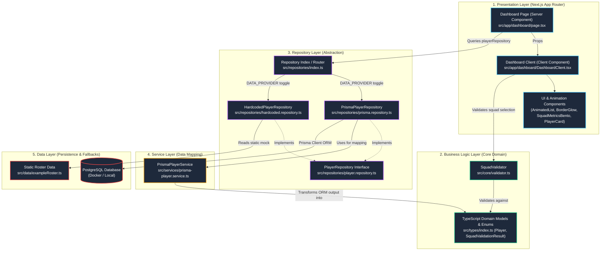

# Architecture Document

## Overview
The Sports Squad Constraint Checker follows a strict layered architecture pattern. This isolates the core validation logic (the "Business Logic") from the Next.js UI, and abstracts external data sources (e.g., PostgreSQL, Redis, Hardcoded files) behind a unified Service and Repository layer.

## Layers

### 1. Presentation Layer (UI)
- **Framework**: Next.js App Router.
- **Pages**:
  - `/login`: Google NextAuth login screen.
  - `/dashboard`: The main tool containing the roster selection, validation results, and formation view.
- **Libraries**:
  - `shadcn/ui` for standard components.
  - `Lenis` for smooth scrolling.
  - `GSAP` for animations.
  - `MagicUI` / `Reactbits` for premium interactive elements.

### 2. Business Logic Layer
- **Responsibility**: Houses the `SquadValidator`, which takes a generic array of `Player` domain models and returns a validation result.
- **Independence**: This layer operates strictly on TypeScript domain models. It has zero knowledge of Prisma, PostgreSQL, Redis, Next.js, or any HTTP routing. 

### 3. Repository Layer
- **Responsibility**: Provides a unified API for the business logic and UI to request player data. 
- **Implementation**: The `PlayerRepository` interface has methods like `getAllPlayers()` or `getPlayersByIds()`. We can swap implementations (e.g., `HardcodedPlayerRepository` vs `DatabasePlayerRepository`) without breaking the system.

### 4. Service Layer
- **Responsibility**: Acts as a mapper between the raw data models (e.g., Prisma models, Redis JSON objects) and our internal TypeScript Domain Data models.
- **Implementation**: The `PrismaPlayerService` translates Prisma ORM output into the `Player` domain type.

### 5. Data Layer
- **Sources**: 
  - PostgreSQL (via Prisma ORM).
  - Hardcoded local static data (for tests and fallbacks).
  - Designed to easily adopt Redis or Object DBs.

## Architectural Diagram

## Data Flow
`Database / Static Data` ➔ `Service (Mapping)` ➔ `Repository Layer` ➔ `TypeScript Domain Model` ➔ `Next.js Server Component` ➔ `Client State & GSAP UI` ➔ `Business Logic (SquadValidator)`
